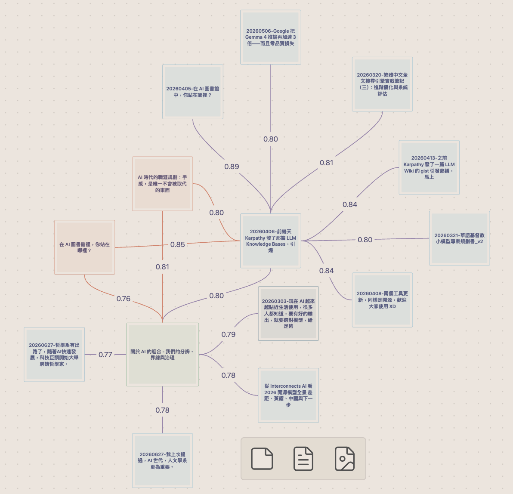

<div align="center">

# Vault Curate

[](https://github.com/notoriouslab/vault-curate/releases)
[](LICENSE)
[](https://obsidian.md/)
[]()
[](https://ollama.com/)
[](https://github.com/notoriouslab/vault-curate)

**找得到、看得見關聯、不遺忘。**

Obsidian 的本地第二大腦。語意搜尋 · 關聯圖 · 語意路徑 · Hot/Cold 遺忘再發現 · 中文/CJK 特強 · WebGPU 加速 · 不上傳資料

[English](./README.md)


</div>

---

## 為什麼選 Vault Curate？

找到一則筆記只是第一步。更難的在後面：*看見*筆記之間的關聯（包括你從沒手動連過的），以及別讓好筆記默默沉沒。Obsidian 內建搜尋只認字面（想到「禱告」找不到「靈修」），內建關聯圖只顯示你手動建的連結，舊筆記則悄悄淡出視線。

[Andrej Karpathy 分享了](https://venturebeat.com/data/karpathy-shares-llm-knowledge-base-architecture-that-bypasses-rag-with-an/)他用 LLM 維護知識庫的願景，讓 AI「編譯」筆記成結構化 wiki。願景很吸引人，但前提是把編輯權完全交給 AI。**Vault Curate 走另一條路：AI 應該幫你「看見」，不是替你思考。**

### 三大差異化特色

| 特色 | 如何做到 |
|---|---|
| **找到 → 看見 → 不遺忘的閉環** | 語意搜尋（BM25 加向量加模糊三路融合）幫你找到；關聯圖與語意路徑浮現你從沒連過的相關筆記；Hot/Cold 分級把你遺忘的舊筆記重新撈回眼前。這三件事在別處都是各自獨立的外掛，三合一才讓它是「第二大腦」而不只是搜尋框。 |
| **幫你看見，不替你思考** | 不在背景跑 LLM，不自動改你的筆記，不用聊天機器人「代替你」回答。AI 整理（description、主題分群 MOC）一律手動開啟。你始終是自己 vault 的編輯者。 |
| **本地優先，中文/CJK 特強** | 裝置端 WebGPU 推論（約 110 MB 模型一次下載、5004 chunks 約 1m23s，WASM fallback 亦可），免 API key。內建 `bge-small-zh-v1.5` 讓中文人名、宗教、口語詞的召回勝過通用多語模型；其他語言可切 Ollama 或 OpenAI。 |

---

## 運作方式：找到 → 看見 → 不遺忘

四個層次串成一個閉環。前三層零設定、隨裝隨用；第四層（整理）預設關閉，要你明確開啟。



### 🔍 找到：語意搜尋

換句話說也找得到，不只字面比對。三種訊號透過 [Reciprocal Rank Fusion](https://plg.uwaterloo.ca/~gvcormac/cormacksigir09-rrf.pdf)（k=60）融合：

| 路徑 | 抓什麼 |
|---|---|
| **BM25**（純 TS，CJK trigram） | 精確片語、關鍵字組合 |
| **語意向量** | 換句話說、同義 |
| **模糊標題**（Jaro–Winkler） | 錯字、拼寫變體 |

- Cmd/Ctrl+P 開 `Vault Curate: 語意搜尋（彈窗）` 快速跳轉；側邊欄 **搜尋** 分頁做持久結果。
- **尋找相似筆記**：對任一 `.md` 右鍵選 **VC: 尋找相似筆記**，結果進側邊欄、可直接拖到 Canvas。相似度具模板抵抗性（1.2.0 起）：剝除 markdown 結構符號、融入 frontmatter `description`，讓人物卡找到*那個人*的對話而不是九張模板兄弟卡；embedding 輸入另做繁→簡轉換（1.2.2 起，儲存文字全程保持繁體）提升繁體 vault 排名。


### 🕸 看見關聯：關聯圖 / 語意路徑 / 原地展開

搜尋幫你找到單篇，這一層幫你看見筆記之間的關係，包括你從沒手動連過的。

**關聯圖（Canvas）**：以任一筆記為中心，生成可編輯的 Obsidian Canvas，top-K 語意鄰居放射排列、每條邊標相似度。

- **紫邊**：語意相近但**尚未連結**，原生 Graph view 看不到的隱形關聯
- **灰邊**（帶箭頭）：已有 wikilink
- **青框**：Cold 筆記

入口有命令面板、右鍵 **VC: 生成關聯圖**、Discover 側欄的**關聯圖**按鈕。每次生成都是帶時間戳的新 `.canvas`（位置在「進階 → 關聯圖資料夾」，預設 `Vault Curate Canvases`），你編輯過的圖永遠不會被覆寫。


**語意路徑（Canvas）**：選任意兩篇筆記，找出連接它們的**中繼筆記鏈**。它在語意 k-NN 圖上跑瓶頸路徑搜尋，整條鏈以*最弱的一跳*評分，牽強的環節藏不進強環節裡。跑「**生成語意路徑（Canvas）**」再挑終點；若不存在全程夠強的鏈，會誠實告知「不連通」並附實際數字，這是資訊，不是錯誤。1.4.5 起底層圖改在**背景 worker** 建（進度提示加取消按鈕，介面完全不凍結），之後每次編輯筆記都以毫秒級增量更新，邊寫邊查照樣秒回。

**在此圖展開**：對 canvas 內任一節點右鍵選 **VC: 在此圖展開**，讓圖原地生長，鄰域落到空位、已在圖上的筆記補連線而不重複、被兩條以上邊指到的筆記變**橙色**（多次展開匯聚到它，通常代表它重要）。你拖過的布局與手動上的顏色一律不動。

**套用紫邊為 wikilink**（1.4.0 起）：圖負責建議，你負責判定，一鍵成真。對生成的 `.canvas` 右鍵（或跑命令）→ 勾選視窗按來源筆記分組列出所有紫邊，Cmd/Ctrl+滑過筆記名可預覽內文。勾選的配對會以真 wikilink 寫進兩篇筆記的「相關筆記」小節（可在「進階 → 雙向寫入」切成只寫來源），該邊當場轉灰帶方向箭頭。沒勾的一個字都不會寫；已採納的建議之後也不會再被重複建議。小節標題可自訂（進階 → 相關筆記小節標題）。

1.4.0 起「相關」本身也變聰明了：尋找相似、關聯圖、當前筆記發掘會把 frontmatter **tags**（字面信號）與語意相似度融合排序，「只是文體像」的筆記不再擠掉「主題真的相關」的筆記。沒有 tags？行為與之前完全相同。

### ♻️ 不遺忘：Hot/Cold 分級加發掘（Discover）

好筆記不該因為你忘了它就等於不存在。筆記依**內部連結加近期活躍度**自動分級：**Hot**（有連結、或近期建立/編輯過——任何編輯都算主動判定，只是打開不算）、**Cold**（孤立且一段時間沒動）。界線在「進階 → Hot 期間（天）」調整，改了立即生效：分級在查詢當下即時計算。

Discover 作用在**筆記**上而非查詢字串，主動浮現你最近沒碰、但語意相關的 Cold 筆記：

- **當前筆記**：打開某篇時自動出現相關筆記（純相關度排序），Cold 視覺標示（「你還沒讀過這篇」）
- **全域**：與你**近期關注**最相關、但已被遺忘的筆記——近期編輯/建立的筆記、它們的主題 tags 與語意質心構成「關注剖繪」，結果按頂層資料夾分組，讓 vault 每個角落最好的遺忘筆記都露臉。這是刻意的盲點挖掘
- 結果可透過 **生成 MOC** 匯出成主題分群的 Map of Content
- **說一次不要，它就記住**：滑過任何建議按 **✕**，這對配對（全域發掘則是這篇筆記）不再出現在建議裡，空出的名額由下一名候選補上。想反悔到「設定 → 進階 → 已隱藏的建議」逐項恢復，每項可直接開啟筆記或複製路徑


### ✨ 整理（選配，預設關閉）

在「**設定 → AI 整理 → 啟用 AI 整理**」開啟後解鎖三件事，全部手動觸發，不在背景自動跑：

- 為單篇筆記生成 description 加 tags 寫入 frontmatter
- 對側邊欄搜尋或發掘結果**批次**跑 description
- 用 HDBSCAN 分群加 LLM 命名生成**主題分群 MOC**

LLM provider 在「**設定 → AI 整理**」獨立指定（本機 Ollama 或 OpenAI-compatible）。

---

## 開始使用

**系統需求**：[Obsidian](https://obsidian.md/) 桌面版（v1.0.0+）。進階路徑才需要本機 [Ollama](https://ollama.com/) 或任何 OpenAI-compatible server。

### 安裝

**從社群外掛（推薦）**
1. 開啟「**設定 → 社群外掛**」，確認「限制模式」已關，點「**瀏覽**」
2. 搜尋 **Vault Curate**，依序點「**安裝**」「**啟用**」

**用 BRAT（可選，追 GitHub release）**
1. 從社群外掛安裝並啟用 [BRAT](https://github.com/TfTHacker/obsidian42-brat)
2. Cmd/Ctrl+P 開 `BRAT: Add a beta plugin for testing`，輸入 `notoriouslab/vault-curate` 後啟用
3. 新版本 BRAT 自動抓取（或用 `BRAT: Check for updates to all beta plugins` 手動更新）

**手動安裝**
1. 從 [Releases](https://github.com/notoriouslab/vault-curate/releases) 下載 `main.js`、`manifest.json`、`styles.css`（兩個 `.wasm` 首次啟動自動下載）
2. 複製到 vault 的 `.obsidian/plugins/vault-curate/`，在社群外掛啟用

> **提示**：vault 有 Git 追蹤的話，把 `.obsidian/plugins/*/data.json` 和 `.obsidian/plugins/*/index.sqlite` 加進 `.gitignore`。

### 首次啟動

啟用後會自動跳出「**歡迎使用 Vault Curate**」視窗：**Embedding 提供者**選「**內建（裝置端、WebGPU）**」，再點「**現在開始建立索引**」。約 110 MB 模型一次性下載加 WebGPU 建索引完成後，點側邊欄羅盤 icon 就能開始。

---

## 參考

### 命令

從 Command Palette（Cmd/Ctrl+P）輸入 `Vault Curate:` 可看到全部。

| 命令 | 說明 | 啟用條件 |
|---|---|---|
| `語意搜尋（彈窗）` | 彈窗式語意搜尋加跳轉 | 永遠可用 |
| `開啟搜尋面板` | 開啟側邊欄面板 | 永遠可用 |
| `尋找相似筆記` | 對當前 `.md` 找語意相似筆記 | 永遠可用 |
| `重建索引` | 砍掉現有索引、全部重新建立 | 永遠可用 |
| `更新索引` | 增量更新（檢查 mtime 變動的筆記） | 永遠可用 |
| `發掘相關的 Cold 筆記` | 全域發掘：與近期關注最相關的遺忘筆記，按資料夾分組 | 永遠可用 |
| `生成關聯圖（Canvas）` | 對當前筆記生成語意鄰域 Canvas | 永遠可用 |
| `生成語意路徑（Canvas）` | 當前筆記到指定終點的瓶頸路徑鏈 | 永遠可用 |
| `套用紫邊為 wikilink` | 勾選視窗把 canvas 上的紫邊（未連結）升級成真 wikilink | canvas 開啟時 |
| `為當前筆記生成 description` | 對當前筆記跑 LLM、寫 frontmatter | 需啟用 AI 整理 |
| `為目前結果生成 description` | 對側邊欄結果批次跑 description | 需啟用 AI 整理 |
| `生成 MOC（主題分群）` | HDBSCAN 分群加 LLM 命名 | 需啟用 AI 整理 |

筆記右鍵選單：**VC: 尋找相似筆記**、**VC: 生成關聯圖**、**VC: 生成語意路徑**、**VC: 在此圖展開**（canvas 開啟時）、**VC: 生成 description**（需啟用 AI 整理）。對 `.canvas` 檔右鍵另有 **VC: 套用紫邊為 wikilink**。

### 設定

| 區塊 | 設定 | 預設 |
|---|---|---|
| **快速設定** | Embedding 提供者（內建 / Ollama / OpenAI-compatible）；排除資料夾 | 內建；空 |
| **AI 整理** | 啟用開關；LLM 提供者；LLM 模型 | 關；Ollama；qwen3:1.7b |
| **進階** | top results、最低分數、關聯圖資料夾、相關筆記小節標題、雙向寫入、Hot 期間、搜尋範圍、chunk 大小加 overlap、同義詞表、自動索引、重建加更新、索引統計 | 見面板 |

切換 embedding 提供者或模型會跳確認視窗，索引清空重建。

### 疑難排解

- **系統大版本更新後的第一次全量重建可能比平常慢很多**：更新後 Spotlight、iCloud、著色器快取都在背景重建，跟索引搶資源。這是暫時性的，風頭過了速度自然恢復，plugin 本身不需要任何處理。

---

## 隱私與安全

三種 embedding 模式，從「快速設定 → Embedding 提供者」選：

| 模式 | embedding 在哪跑 | 筆記文字去哪 |
|---|---|---|
| **內建** | 裝置端 WebGPU / WASM | 留在你的裝置 |
| **Ollama（本機 daemon）** | 127.0.0.1 本機 Ollama daemon | 留在你的裝置 |
| **OpenAI-compatible API** | 你指定的任何 endpoint，本機（LM Studio、llama.cpp…）或遠端（OpenAI 等） | 取決於 endpoint，可能離開裝置 |

AI 整理（description 或 MOC 命名）也一樣，用獨立設定的 LLM endpoint。

**無遙測。無使用追蹤。除非你設定遠端 endpoint，否則不送任何東西到任何伺服器。**

### 稽核揭露

Obsidian Developer Dashboard 的自動稽核可能對本 plugin 標記以下項目。它們都是刻意設計，在此透明揭露：

- **Vault 列舉**（`vault.getMarkdownFiles()`）：索引器需要走過 vault 全部 markdown 檔清單來建語意索引。「排除資料夾」設定（設定 → 進階）可縮限範圍，例如排除 `_templates/`、`.trash/` 或任何你不想索引的資料夾。檔案在進入包含集合前不會被讀取。
- **動態程式碼執行**（bundled `@huggingface/transformers` 裡的 `new Function`）：Hugging Face Transformers 函式庫內部用 `new Function` 建立型別安全的方法分派器。Vault Curate 自己的原始碼含 **零** `eval()` 或 `new Function()`。我們原樣打包上游函式庫以避免分歧；動態分派只發生在 embedding 模型的 tokenizer/inference 設定，不碰任何 vault 內容。
- **直接檔案系統存取**：bundled `sql.js` 附帶 Emscripten 輸出，含 Node.js fallback 路徑會 import `node:fs` / `node:crypto`。這些分支在 Obsidian 的 renderer process 是死碼（由 `process.type !== "renderer"` 把關）。從 v1.0.3 起，esbuild 設定會從發布 bundle 剝除那些 `require()` 字串，稽核不再看到。

### 🔒 關於 API key 儲存

Vault Curate 和所有 Obsidian plugin 一樣，把設定（含任何 OpenAI API key）以純文字存在 `<vault>/.obsidian/plugins/vault-curate/data.json`。這是 Obsidian 的 plugin 儲存機制，不是 vault-curate 特有的設計。

若你的 vault 同步到雲端（iCloud / Dropbox / Google Drive）或推到公開 Git repo，你應該：

1. 把 `.obsidian/plugins/vault-curate/data.json` 加進同步排除清單或 `.gitignore`
2. 或改用 **內建** 模型或 **Ollama** 路徑，兩者都不需 API key

---

## 技術架構

| 層 | 用什麼 |
|---|---|
| **儲存** | `sql.js`（SQLite via WASM），取代 v0.x 的 `data.json` / `index.json` |
| **關鍵字搜尋** | 純 TS BM25+（`src/storage/bm25.ts`），CJK 友善、不依賴原生 FTS5 |
| **語意 embedding** | `@huggingface/transformers` 加 `bge-small-zh-v1.5` q8（約 110 MB，WebGPU/WASM，裝置端） |
| **融合** | Reciprocal Rank Fusion（k=60）串 BM25、語意、模糊 |
| **分群** | `hdbscan-ts`（主題分群 MOC） |
| **建置** | TypeScript 加 esbuild（worker 與 main 兩段式 bundle） |
| **可選** | [Ollama](https://ollama.com/) 或 OpenAI-compatible endpoint 換更高階 embedding 或 LLM |

---

## 開發

```bash
git clone https://github.com/notoriouslab/vault-curate.git
cd vault-curate
npm install
npm run dev    # watch 模式
npm run build  # production build
npm test       # vitest 單元測試
```

---

## 授權

[MIT](./LICENSE)
